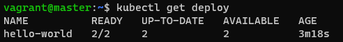
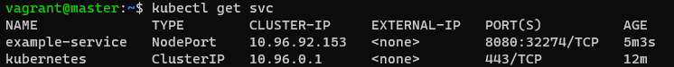
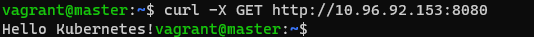
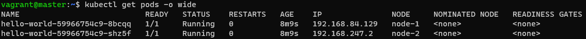

# 1. 목표
* helloworld deployment를 생성하고 서비스 노출

# 2. 실행
## 2.1 deployment 생성
* helloworld.yaml파일 생성
```yaml
apiVersion: apps/v1
kind: Deployment
metadata:
  name: hello-world
spec:
  selector:
    matchLabels:
      run: load-balancer-example
  replicas: 2
  template:
    metadata:
      labels:
        run: load-balancer-example
    spec:
      containers:
        - name: hello-world
          image: gcr.io/google-samples/node-hello:1.0
          ports:
            - containerPort: 8080
              protocol: TCP

```

* deployment 생성
```sh
kubectl apply -f helloworld.yaml
```

<br>

## 2.2 deployment 생성 확인
```sh
kubectl get deploy
```

<br> deploy생성 확인

<br>

## 2.3 service 생성
```sh
kubectl expose deployment hello-world --type=NodePort --name=example-service
```

<br> service생성 확인

<br>

## 2.4 웹 페이지 GET요청
```sh
curl -X GET http://10.96.92.153:8080
```

<br> 웹 페이지 방문 결과

<br>

# 3. pod확인
* pod를 확인하면 replica설정 때문에 <strong>node-1, node-2</strong>에 pod가 생성


<br> pod 2개 생성확인

<br>

# 참고자료
* [1] 공식문서: https://kubernetes.io/ko/docs/tasks/access-application-cluster/service-access-application-cluster/