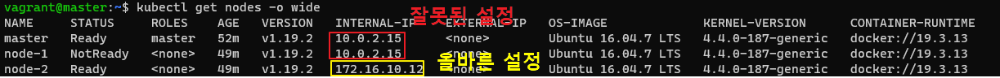

# 개요
* kubelet ip를 수정하지 않으면 컨테이너가 실행 되지 않음


<br> kubelet ip설정(빨간색박스: 잘못된 설정, 노란색박스: 올바른 설정)

<br>

# 수정 방법
* /etc/systemd/system/kubelet.service.d/10-kubeadm.conf파일에 IP환경변수 추가
* 예) 172.16.10.12 IP를 갖고 있는 노드
```sh
Environment="KUBELET_EXTRA_ARGS=--node-ip=172.16.10.12"
```

<br>

# ansible연동
* ansible 변수{{ ansible_host }}은 host_ip를 갖고 있다.
* 이 IP를 이용해서 파일에 쓰는 동작을 수행
```yaml
---
- hosts: node2
  become: true
  gather_facts: no
  tasks:
    - name: Configure node ip
      lineinfile:
        create: yes
        path: /etc/systemd/system/kubelet.service.d/10-kubeadm.conf
        line: Environment="KUBELET_EXTRA_ARGS=--node-ip={{ ansible_host }}"
    - name: Restart kubelet
      service:
        name: kubelet
        daemon_reload: yes
        state: restarted
```

# 참고자료
* https://github.com/kubernetes/kubeadm/issues/203