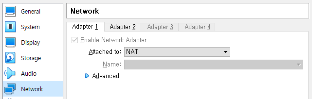
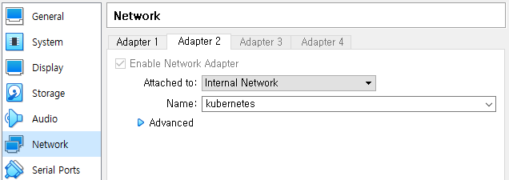

# 1. 기본 설정
## 1.1 IP
* 쿠버네티스 마스터노드 IP: 172.16.10.10
* 쿠버네티스 워커노드 IP: 172.16.10.x
* Ansible 서버 IP: 172.16.10.240
## 1.2 하드웨어
* 램: 2GB
* CPU 코어 갯수: 2

## 1.3 네트워크 인터페이스
* NAT와 internal 인터페이스 구축
  

<br>NAT인터페이스

<br>


<br>internal 인터페이스

<br>

# 2. 설정 변경
## 2.1 IP설정
* [문서링크](./마스터&워커노드_IP수정.md)
## 2.2 하드웨어 사양 변경
* Vargrant config.vm 변경
```yaml
config.vm.provider "virtualbox" do |v|
    v.memory = 2048 <-- 램
    v.cpus = 2 <-- cpu
end
```